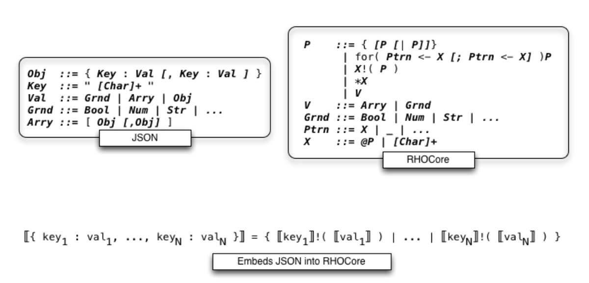
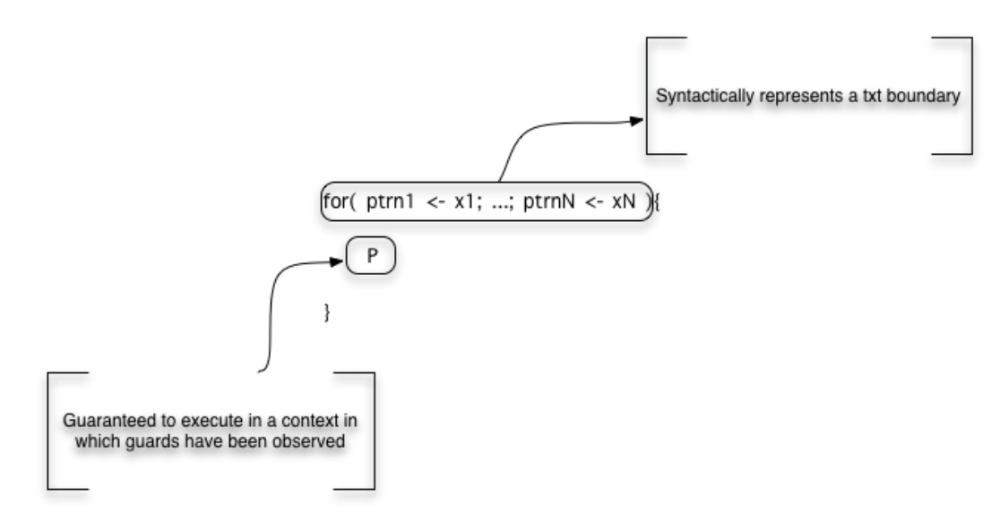
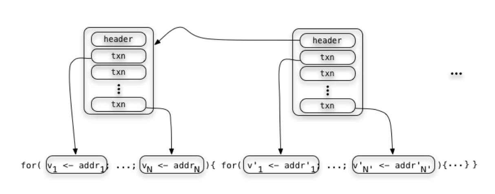

.. _enter-the-blockchain:

*******************************************************************************
Enter the blockchain
*******************************************************************************

One simple way to interpret blockchain technology is that it provides a decentralized replication technology. State can be replicated across a network of nodes without a centralized authority managing the replication. The subtle interplay between this replication mechanism and economics-based security sometimes obscures the basic value of the replication, itself. Replication of this nature is already a high impact value proposition. Witness Ethereum’s proposal. The essence of it is to replicate the state of a virtual machine, instead of the state of ledger, on the blockchain. This provides not just a smart contracting system, but a global public compute resource that cannot be taken down.

More than Wall St or the City should be sitting up and taking notice. Amazon’s AWS, Google’s Cloud Service, Microsoft’s Azure, all of these businesses become profoundly affected by the Ethereum proposal. The fact that the ledger, or economic aspect of replicated state can now be used as an economic security measure against DoS attacks on the global compute resource serves to strengthen the proposal. It also changes the nature of the ecosystem that uses these services.

The entire value proposition of cloud service infrastructure providers vitally depends on microtransactions linked to the use of compute resources. The Ethereum proposal integrates this at lowest level of execution and storage, in a manner that is crucial to the security of the system. It’s simply a better, more elegant design than incumbent cloud solutions. More importantly, it’s realized as a public resource. One of the recent revolutions that shares some characteristics of this emerging situation is the shift in telecommunications as a result of the Internet. The telephony providers knew that the Internet was going to change the way telecommunications was done and had to scramble to adapt and adjust to a landscape where more than half of long distance telecommunications would be conducted using free services like Skype, zoom, and Google Hangouts. Cloud infrastructure service providers, and the whole interconnected network of services running on them will likewise have to shift to a landscape where there is a sophisticated cryptocurrency market integrated with globally available, public compute resources at the lowest level.

Casper
===============================================================================

At the 20K foot level this is a profound idea, but at the level of execution for production systems, it highlights several desiderata. First of all, it requires a different replication technology! The very technology that gave birth to the Ethereum proposal is the first thing that has to be re-imagined to make Ethereum’s idea viable at Internet scale for production systems. Proof of work is simply too costly in terms of energy. The arguments for this are numerous, and all of the major stakeholders in Ethereum’s development community have embraced them. Instead, a new pay-to-play algorithm, called Casper, is under development by a loose federation of stakeholders, including Buterin, Zamfir, and Meredith.

Bet by block versus bet by proposition
-------------------------------------------------------------------------------

At the core of the Casper consensus algorithm is a cycle of message exchange amongst validators participating in the replication protocol. This cycle of message exchange ultimately converges to produce the consensus state. The protocol is factored in such a way that the consensus cycle, sometimes called the betting cycle, works independently of the type of state on which the validators are developing a consensus. It could be used to develop consensus on a single boolean value (e.g. the result of a coin flip), or something much more sophisticated, like the state of a virtual machine. This is further articulated into how the state is packaged. Specifically, the very name, blockchain, refers to the fact that state is packaged in blocks that are chained together. Thus, a very natural object of the consensus cycle is a block. Roughly speaking, validators exchange messages to converge on the next block in the chain.

This represents a natural, step-by-step evolution from PoW algorithms. Notice, however, that this rate limits block production to the rate of consensus cycle. Because blocks constitute a packaging of transactions (txn’s for short), this provides a rough estimate of the transaction processing capability of the algorithm. Vitalik’s PoC suggests that this is much, much faster than PoW-based BTC blockchain performance. However, the aim is to get into the range of 40K txns/sec, roughly on par with the transaction rates of financial networks like Visa.
To achieve this we make two fundamental observations. The first of these is common sense: most transactions are isolated. The transaction associated with the person buying car parts in Shanghai is separate and isolated from the transaction associated with the person buying coffee in Seattle. Isolation of multiple concurrent transactions follows the same principle as the multi-lane freeway. As long as there’s little to no lane-changing, there’s a much greater throughput on a multi-lane freeway than on a single lane highway. No lane-changing is what we mean by isolation. Following this analogy, we want a block to represent a section of highway with multiple lanes for which there is virtually no lane-changing.

The other observation is more subtle. It has to do with programmatic compression. One analogy that might help comes from computer graphics. For many images, such as that of a fern, there are two fundamentally different ways to draw the image. In one of them, a large set of data points corresponding to pixels is provided to the renderer. Presumably, this data set is provided by sampling, such as might be provided by scanning an actual fern. The other way is to recognize that there is an algorithmic pattern associated with ferns that is essentially captured by a fractal. Then the data set of pixels can be represented in a tiny program that generates the fractal image corresponding to the fern. In this sense the program represents a form of compression. Rather than ship the large data set of pixels to the renderer, a relatively small program is shipped instead, and the renderer runs the program to get a stream of pixels it can pull as fast as it can draw.

Collections of transactions can be given similar compression using propositions. The LADL algorithm of Stay and Meredith describes precisely how a proposition corresponds to a collection of transactions. What remains is how to relate different propositions proposed by different validators. Specifically, suppose validator Abed is looking at transactions arising from one portion of the network while validator Troy is looking at transactions arising from another portion of the network. Assuming Abed and Troy are communicating about those groups of transactions using propositions, how do we make sure that the groups of transactions are consistent? This is where propositions as interpreted by the LADL algorithm have significant compression power.

By reasoning via the logical level it is possible to determine whether a collection of propositions is consistent. In the case of propositions interpreted by the LADL algorithm they will be consistent if and only if the meaning of their combination (say conjunction) (i.e. the collection they denote) is not empty. When the combination is empty then one or more of the propositions is inconsistent. At this point the validators invoke the Casper betting cycle to pick a winner amongst the maximally consistent subsets of propositions. Once the betting cycle converges, the block that is determined is given in terms of a collection of consistent propositions which then expands out to a much, much larger set of transactions, much the same way that the fern is rendered from the fractal decompression algorithm that produces the pixel set for the image.

From data storage to block storage in the RChain model
-------------------------------------------------------------------------------

Building on the observations in the section on content storage and query we can
detail a direct representation of JSON into a fragment of the rholang syntax
referred to in the diagram below as RHOCore.

   RSON : RChain data representation

This illustrates a meta-level point about the data storage interpretation. The storage and access semantics is consistent with a self-hosted serialization format, for rendering state to disk or wire. in practical terms, whatever a programmer has rendered to JSON for serialization on the wire or storage in a database like mongodb, can be rendered to an isomorphic expression in a fragment of the rholang syntax; and that expression, if it were executed, would effect the storage. Moreover, the complexity of the format exactly mirrors JSON. However, the spatial types of rholang serve to provide a type directed data validation mechanism for serializing and deserializing the data.

However, this only uses the output or producer side of the representation. By including the input or consumer side of the representation we can also provide a faithful and efficient representation of block structure. First note the meaning of the input guarded form. The continuation is guaranteed to execute in a context in which the values have been observed at the channels.

   RSON : RChain data representation

This is precisely a transactional guarantee. From this we can create a faithful interpretation of block structure that corresponds precisely to program syntax.

   RSON : RChain data representation

   Block representation also embeds directly into RHOCore

Sharding
===============================================================================

Another desideratum in making the Ethereum proposal practical is to ditch the global computer! Instead of a single VM running on the blockchain, what is required is a composition of VMs each serving a shard of client processing. In some sense this marks a return to the original vision of the Internet as conceived when the Rosette/ESS design was proposed. There are some key differences, however. First, the state of each VM is stored on the blockchain. Second, though each VM is cut of the same cloth there is a discipline governing how they interact. Specifically, though they are all effectively copies of the same VM, each is operating on specific virtual address spaces, or namespaces as we have been calling them. When they are operating on the same namespace we have the guarantee that the state across each copy is exactly the same. This is what the consensus algorithm is for.

The use of a compositional account of namespaces to coordinate amongst the VMs is one of the key ingredients missing in Ethereum’s VM design, and the principal reason it is not compositional. The other core change is that the RChain machine design, like the Rosette/ESS design is fundamentally concurrent. Smart contracts in RChain, like actors in Rosette/ESS enjoy fine-grained concurrency during their execution. Two key factors contribute to making this safe for financial transactions.

Concurrency, non-determinism, and safety
-------------------------------------------------------------------------------

The two mechanisms that allow fine-grained concurrent execution to be safe in the distributed setting operate at fundamentally different levels. One is a runtime mechanism and the other is a compile time mechanism. The runtime is easier to understand. The non-determinism arising from concurrent execution associated with a contract always arises as a race of the form:

* two outputs racing to serve one input request

.. code-block:: scala

   x!( v1 ) | for( y <- x )P | x!( v2 )

* two input requests vying for a single output

.. code-block:: scala

  for( y <- x )P1 | x!( v ) | for( y <- x )P2

Whether that race arises from computation inside the contract or between the contract and its environment. In either of the two possible race cases, for the contract to make progress one of the reductions will be chosen and that choice is the transaction. That’s the meaning of the transactional boundary described above. Hence, these are the transactions that are replicated by the Casper consensus algorithm. Thus, while there is internal non-determinism, the replicated state is deterministic. All nodes in the same shard see the same state.

This still makes it possible to write unsafe code. Despite the determinism of the EVM, the DAO bug shows up as a kind of unfairness in scheduling state updates relative to servicing new client requests; and, when expressed as a rholang contract, arises as an unwanted race condition. That is, there is a level of non-determinism that was allowed by the contract that wasn’t safe with respect to the intended semantics of the contract. In most practical situations these can be detected and prevented at compile time using the spatial behavioral types of rholang. It is certainly the case in the specific instance of the bug exploited in the attack against the DAO.

What is a VM?
-------------------------------------------------------------------------------

Let’s take a moment to review what’s in a VM. Every VM corresponds to a table.
The table lists a set of transitions. The transitions are of the form::

  <byte code, machine state> -> <byte code’, machine state’>

The transitions specify what happens when a machine in a given state encounters
a particular byte code instruction::

  rosette> (code-dump (compile '(+ 1 2)))
  litvec:
     0: {RequestExpr}
  codevec:
     0: alloc 2
     1: lit 1, arg[0]
     2: lit 2, arg[1]
     3: xfer global[+],trgt
     5: xmit/nxt 2
  rosette>

Examples include loading a literal into a register or popping register values and adding them. Registers, heap, stack, these are examples of components of the machine state. In the case of the RhoVM the most important transition is the one associated with I/O::

  for( y <- x )P | x!( Q ) -> P{ @Q / y }

This transition says that when an input guarded thread in the VM is waiting for input on x is running concurrently with a thread committing and output on x, then the data passes along x, is bound to the variable y in the continuation P. It is important to understand that this is really a higher level transition that may involve many lower level state changes. This is because x may be bound to a wide variety of channels, from tables in local storage, to AMQP queues, to tcp/ip sockets. Each of these has a natural semantics that interoperates smoothly with this higher level transition rule. The interoperation between this high level transition rule and different channel semantics is precisely what the Tuplespace semantics provides.

What’s important for this discussion, however, is the recognition that a given VM instance, i.e. a copy of the VM table plus a specific configuration of machine state, can be restricted to operate on a specific collection of names. This collection of names, what we have been calling a namespace, can be programmatically specified and hence not necessarily finite.

In this architecture a shard corresponds roughly to a namespace and a machine instance and the RChain nodes on in the network on which the state of this VM is stored. We say ‘roughly’ because shards may be composed of shards, meaning that there are subgroups of the nodes in a given shard that replicate machine state restricted to a subspace of the namespace. Likewise, because VMs can only interoperate if they have overlapping namespaces, multiple shards can be overlaid on the same nodes. This provides both availability and security features because using these facts about the relationships of VM, nodes, and namespaces, finding a correlation between physical locations of nodes and namespaces can be made as computationally hard as desired.

